+++
draft = false
title = 'report #1'
+++
# Лабораторная работа: Работа с Git  
**Студент:** Арина  
**Группа:** PЗ468  

---

## Цель работы
Освоить базовые команды **Git** для работы с локальными и удалёнными репозиториями.  
Научиться выполнять основные операции — инициализацию, добавление файлов, создание коммитов, ветвление и слияние — как в терминале, так и через графический клиент **GitHub Desktop**.

---

## Подготовка окружения
1. Установлен Git и **GitHub Desktop**.  
2. Создана папка `test_repo_for_web` — локальный репозиторий для экспериментов.  
3. Настроено подключение к удалённому репозиторию GitHub.

---

## Ход выполнения

### 1. Создание репозитория
Создана новая папка:
```bash
test_repo_for_web
```
В ней будет находиться локальный репозиторий Git.  
Команда:
```bash
git status
```
показала, что репозиторий пуст, коммитов нет, ветка `master`.

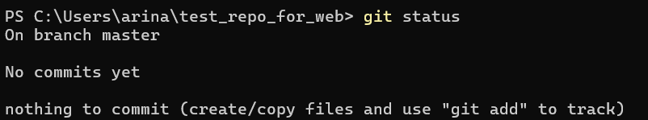


---

### 2. Создание файла и первый коммит
Создан новый пустой файл:
```powershell
New-Item README.txt -ItemType File
Add-Content README.txt "привет!"
```

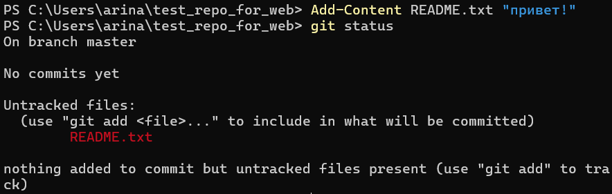
Файл появился как *untracked*.  
Добавление и фиксация изменений:
```bash
git add README.txt
git commit -m "first file"
```

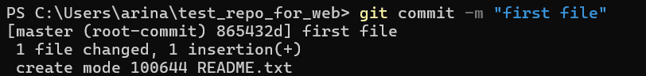


---

### 3. Изменение и добавление нескольких файлов
Добавлен текст в файл:
```powershell
Add-Content README.txt "привет, мир!"
```
Git отмечает `README.txt` как *modified*.  
Добавлены все `.txt` файлы:
```bash
git add '*.txt'
```
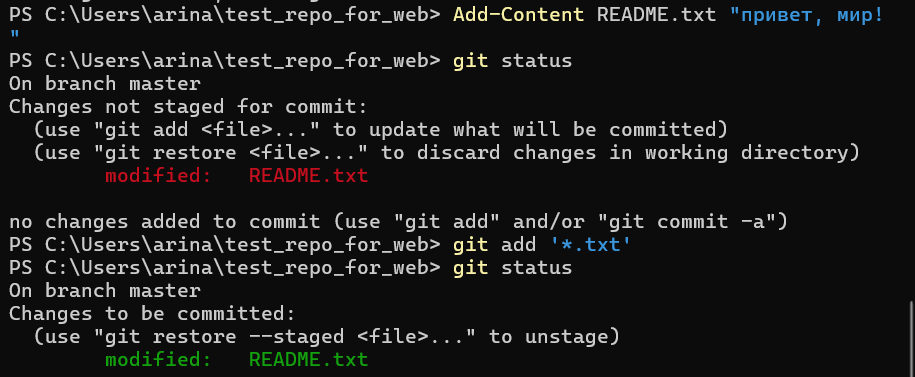
Создан новый файл `README-ENG.txt`, затем:
```bash
git commit -m "all files with .txt extension were added"
```
Изменены 2 файла: добавлен `README-ENG.txt`, обновлён `README.txt`.

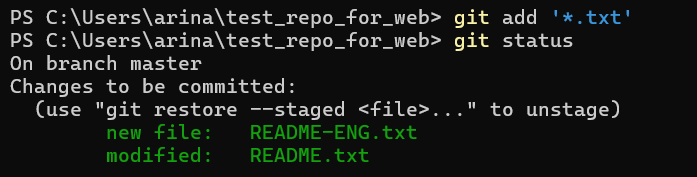
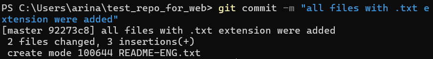
---

### 4. Просмотр истории
```bash
git log
git log --summary
```
Отображена история коммитов и подробности изменений.
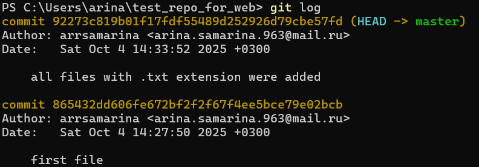

---

### 5. Добавление удалённого репозитория и push
```bash
git remote add origin <URL_репозитория>
git push -u origin master
```
После добавления строк:
```powershell
Add-Content README.txt "hello!"
Add-Content README-ENG.txt "world!"
```
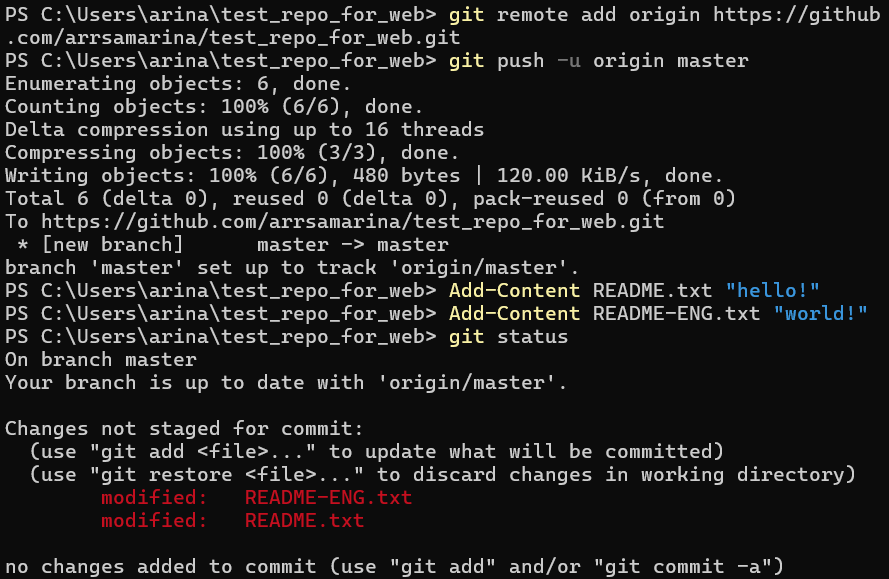
и выполнения:
```bash
git add '*.txt'
git commit -m "all files with .txt extension were changed"
git push -u origin master
```
локальная ветка `master` синхронизирована с `origin/master`.

---

### 6. Получение изменений и сравнение версий
```bash
git pull origin master
git diff HEAD
```
После добавления строки `"hello!"` в `README.txt` Git показал зелёную строку `+hello!`, означающую новое добавление.
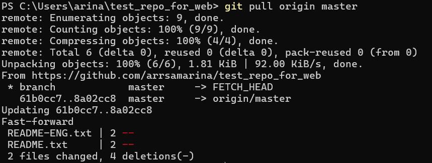

---

### 7. Работа с папками и файлами
Создана структура:
```bash
mkdir folder
New-Item folder/file.txt -ItemType File
```

Git сообщает:
- `README.txt` — изменён (modified),
- `folder/` — неотслеживается (untracked).

Добавление в индекс:
```bash
git add README.txt folder/.
```

---

### 8. Проверка staged-изменений и отмена
```bash
git diff --staged
git reset folder/file.txt
git diff
git checkout -- README.txt
```
Файл `README.txt` возвращён к последнему зафиксированному состоянию.  
В репозитории осталась только неотслеживаемая папка `folder/`.

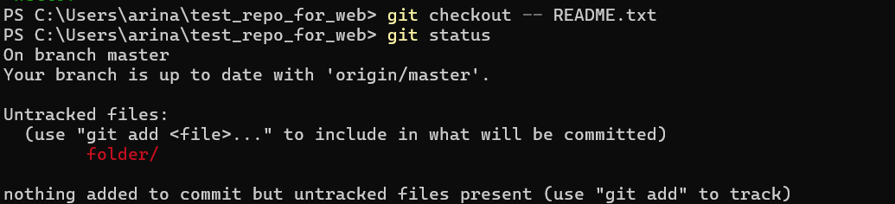
---

### 9. Работа с ветками
Создание и переход:
```bash
git branch clean_up
git branch
git checkout clean_up
```
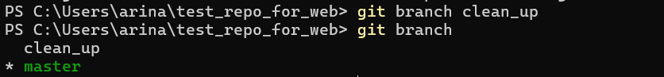

Удаление и фиксация:
```bash
rm -r folder
git rm README-ENG.txt
git commit -m "deleted folder and files"
```


Возврат и слияние:
```bash
git checkout master
git merge clean_up
git push
```
Изменения из `clean_up` успешно объединены с `master`.

---

## Работа через GitHub Desktop

### 1. Создание нового репозитория  
Создан новый репозиторий прямо из GitHub Desktop.  
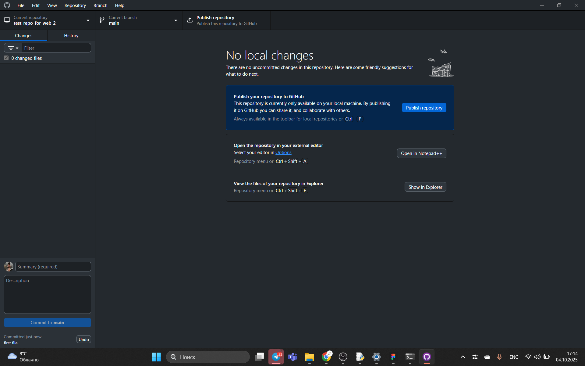

---

### 2. Добавление файлов  
В проводнике добавлен файл `README.txt`.  
Сделан первый коммит — изменения отображаются во вкладке **Changes** и **History**.  


---

### 3. Изменение и коммит  
Добавлен новый файл `README-ENG.txt`, изменён `README.txt`.  
Закоммичено и опубликовано на GitHub.  


---

### 4. Работа с ветками  
- Создана ветка `clean_up`  
- Удалён файл `README-ENG.txt`  
- Переключение обратно на `main`  
- Выполнен merge ветки `clean_up` в `main`  
- Изменения запушены  
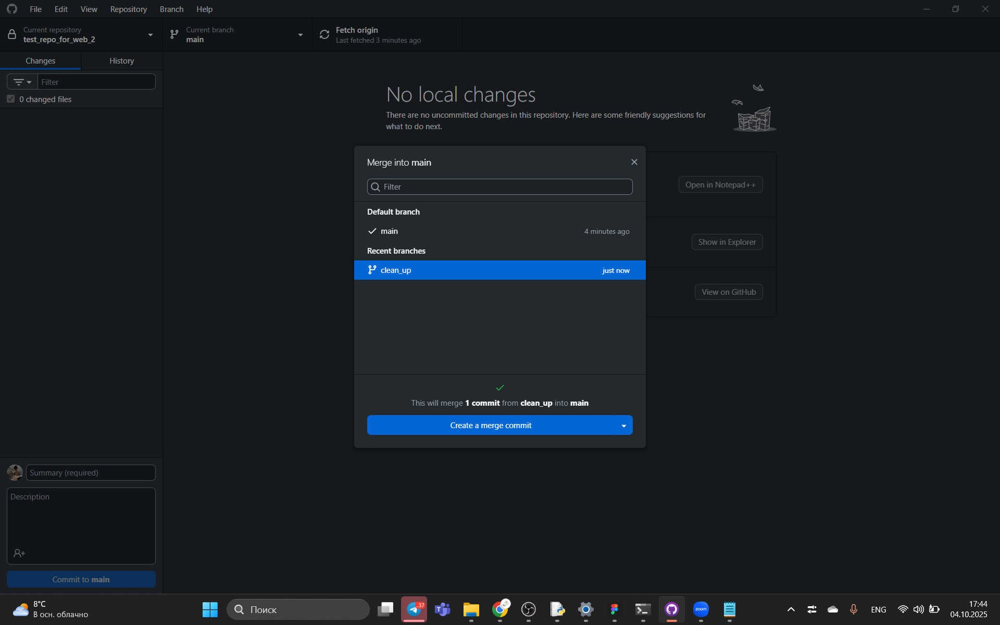

---

### 5. Итоговый вид репозитория  
На GitHub отображаются все изменения: история коммитов, удаление файлов и актуальное состояние ветки `main`.  


---

## Результаты
- Изучены и применены команды:  
  `git init`, `git add`, `git commit`, `git log`, `git diff`, `git branch`, `git merge`, `git push`, `git pull`, `git rm`.  
- Получены навыки работы с ветками и индексом.  
- Освоен интерфейс **GitHub Desktop** и работа с удалённым репозиторием.

---

## Вывод
В ходе лабораторной работы были освоены базовые принципы работы с системой контроля версий Git.  
Закреплены практические навыки работы в терминале и графическом клиенте.  
Процесс синхронизации с GitHub отработан полностью — от создания репозитория до push-коммитов и работы с ветками.

---

## Приложение
Для оформления отчёта использован формат **Markdown (.md)**.  


