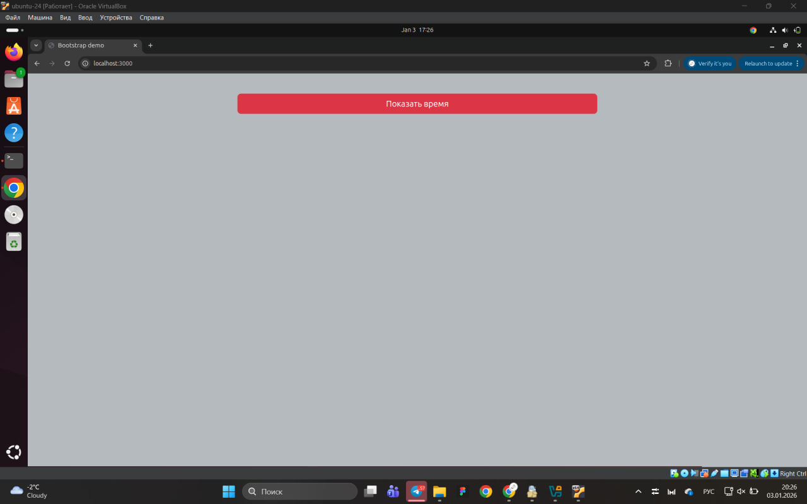
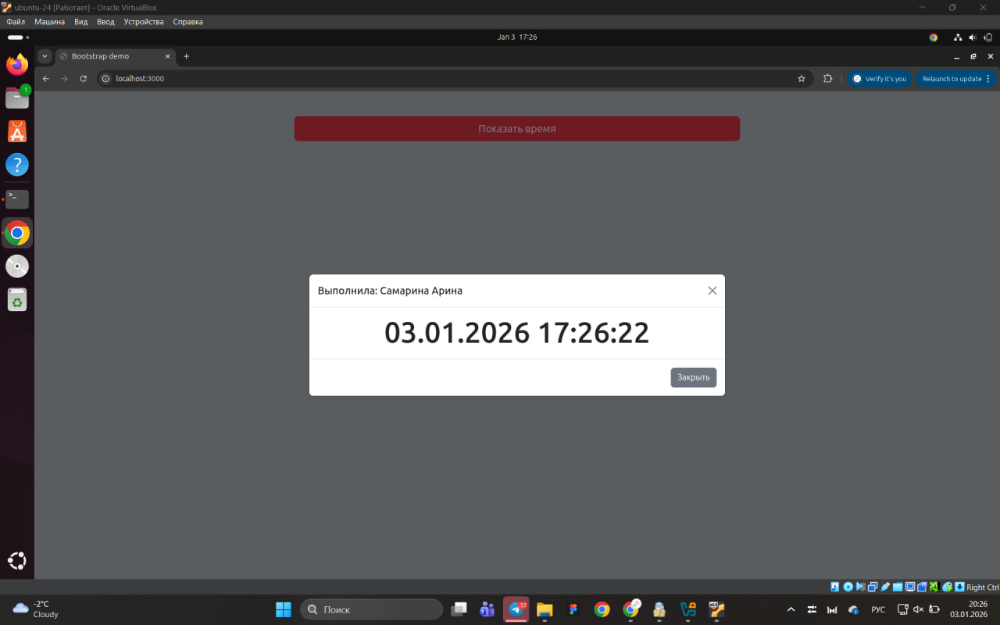
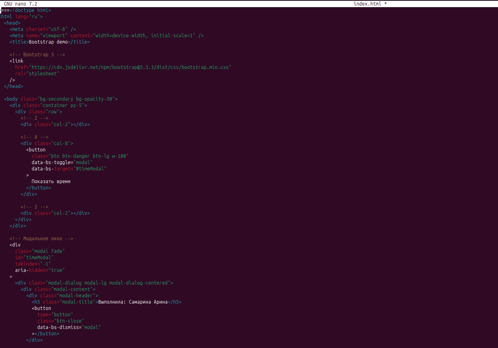
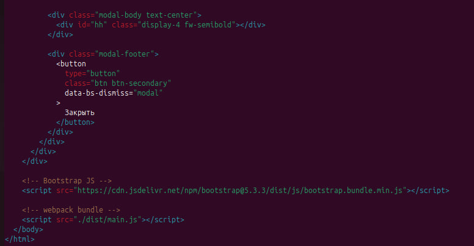

## Интеграция Bootstrap 5 и Luxon

В рамках данного задания было выполнено расширение приложения, созданного на предыдущем этапе, с использованием CSS-фреймворка **Bootstrap 5** и библиотеки **Luxon**.

На странице была реализована адаптивная сетка Bootstrap, состоящая из трёх колонок с соотношением **2–8–2**.  
В центральной колонке размещена большая красная кнопка, занимающая всю доступную ширину колонки, с текстом **«Показать время»**.

При нажатии на кнопку открывается модальное окно Bootstrap.  
В заголовке модального окна указано имя и фамилия автора работы.  
В основном содержимом модального окна отображается текущая дата и время, получаемые с помощью библиотеки **Luxon**. Обновление времени происходит динамически.

Модальное окно может быть закрыто двумя способами:
- с помощью крестика в правом верхнем углу;
- с помощью кнопки **«Закрыть»** в правом нижнем углу.

Для сборки проекта использовался **webpack**, который формирует единый JavaScript-бандл, подключаемый к HTML-странице.  
Для локального запуска приложения применялся встроенный сервер **serve**.

В результате было получено корректно работающее веб-приложение с использованием **Bootstrap 5** и **Luxon**, полностью соответствующее требованиям задания.

---

## Скриншоты 

**Рисунок 1 — Главная страница приложения с кнопкой «Показать время», реализованной с использованием Bootstrap 5**

**Рисунок 2 — Модальное окно Bootstrap с отображением текущей даты и времени с помощью библиотеки Luxon**

**Рисунок 3 — HTML-разметка страницы приложения с использованием Bootstrap 5**

**Рисунок 4 — Остаток HTML-разметки и фрагмент JavaScript-кода приложения, отвечающий за работу модального окна и отображение времени**

